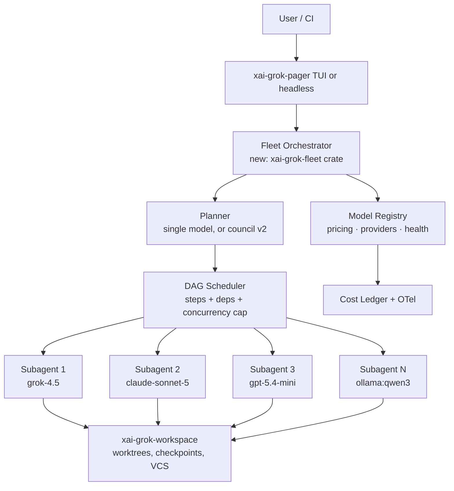

# Fleet Mode — Multi-LLM Parallel Orchestration for Grok Build

**Status:** Draft v0.2 · 2026-08-01 — §10 interim path **implemented** in this repo ([forge/fleet/](../forge/fleet/), 79 tests passing); §11 subscription executors added
**Native home (fork):** [rrhoopes3/grok-build-fleet](https://github.com/rrhoopes3/grok-build-fleet) — fork of [xai-org/grok-build](https://github.com/xai-org/grok-build) where Fleet Mode Rust/`xai-grok-fleet` lands (upstream accepts no external PRs)
**Concepts merged:** Grok Build (terminal coding agent) × Grok Party Pack "Forge" orchestration core (this repo)
**Explicitly out of scope:** everything game-shaped — chess arena, NES arena, gladiator arena, prophecy engine, LCARS theming, toll/settlement. Only the orchestration machinery crosses over.

---

## 1. Summary

Grok Build is a single-model coding agent with excellent bones: TUI + headless + ACP embedding, subagents with parallel child sessions, MCP/skills/plugins/hooks, sandboxing, checkpoints. The Forge is a multi-provider orchestrator with the opposite strength: it treats *models as a fleet* — a priced registry across xAI/Anthropic/OpenAI/local, parallel fan-out over a dependency DAG, health-aware failover, and per-step cost accounting — but its executor is homegrown and weaker than Grok Build's.

**Fleet Mode** merges them: Grok Build remains the agent runtime and UX; the Forge's orchestration concepts become the layer that lets one Grok Build session decompose work and run it across *N parallel subagents, each bound to a different LLM*, with routing, failover, and a live cost ledger.

One sentence: *Grok Build, but the subagent fleet can be Grok 4.5 + Sonnet 5 + GPT-5.4-mini + a local Qwen, all at once, scheduled over a DAG.*

## 2. What each side contributes

| Capability | Grok Build (keep as-is) | Forge (port the concept) |
|---|---|---|
| Agent loop, tools, editing, shell | `xai-grok-shell`, `xai-grok-tools` | — |
| TUI / dashboard | `xai-grok-pager`, Agent Dashboard (user-guide #23) | — |
| Parallel child sessions | Subagents & Personas (user-guide #16) | — |
| Custom endpoints (BYOK, Ollama, OpenAI-compat) | user-guide #11 | — |
| **Priced multi-provider model registry** | — | `EXECUTOR_MODELS` ([forge/config.py:34](../forge/config.py)) |
| **Provider layer w/ health + cost + quirk handling** | — | [forge/providers.py](../forge/providers.py) (`detect_provider`, `run_anthropic`, `run_openai`, `is_provider_healthy`, `calculate_cost`) |
| **DAG-parallel step execution** | — | `DAGPlan` / `DAGExecutor` ([forge/dag.py](../forge/dag.py)) |
| **Multi-agent planner council** | — | 16-agent planner ([forge/planner.py](../forge/planner.py)) |
| **Delegation contracts / trust / rerouting** | — | [forge/delegation.py](../forge/delegation.py) (v2 — see §8) |

The Forge code is the *reference implementation* (Python interim). The long-term shipped artifact is Rust on **[rrhoopes3/grok-build-fleet](https://github.com/rrhoopes3/grok-build-fleet)** — a fork of the public xAI mirror, because upstream does not accept external contributions. The port is of semantics, schemas, and hard-won lessons, not a Python re-embed of the agent loop.

## 3. Goals

1. **Per-subagent model binding.** Any subagent/persona can declare `model = "claude-sonnet-5"` (or be assigned one at spawn time). Today's parallel child sessions inherit the parent model; Fleet Mode makes the model a first-class per-agent property.
2. **Model registry with pricing and provider metadata.** A TOML-native port of `EXECUTOR_MODELS`: id → provider, label, $/Mtok in/out, capability flags (reasoning tier, temperature support, local). Registry drives the model picker, cost meter, and router.
3. **DAG-parallel task execution.** A plan whose steps declare dependencies executes with maximum safe concurrency — independent steps fan out to parallel subagents (possibly on different models); dependent steps wait.
4. **Smart routing + failover.** An `auto` pseudo-model routes each step by task class and budget (cheap model for mechanical edits, frontier model for design/verify). Provider-level health tracking reroutes to a fallback chain on 5xx/timeout instead of failing the step.
5. **Fleet cost ledger.** Per-agent and per-task token/cost accounting rolled up live in the TUI and dashboard, exported via the existing OTel path (user-guide #24). Budget caps abort or downgrade the fleet when exceeded.
6. **Headless parity.** Everything above scriptable: `grok-build --headless --fleet fleet.toml "task"` for CI.

### Non-goals

- No new agent runtime, TUI, or tool layer — Grok Build's win.
- No port of Forge packs, games, LCARS UI, toll system, or vault.
- No cross-provider *conversation splicing* (one message thread bouncing between models mid-turn). Fleet granularity is the subagent/step, which is where the value is and where the compatibility traps aren't.

## 4. Architecture



- **`xai-grok-fleet` (new crate, lives in the fork):** registry, router, DAG scheduler, ledger. Sits beside `xai-grok-shell` in [rrhoopes3/grok-build-fleet](https://github.com/rrhoopes3/grok-build-fleet); spawns subagents through the existing child-session API rather than reimplementing the loop.
- **Workspace isolation:** parallel subagents that write files get isolated worktrees/checkpoints via `xai-grok-workspace` — the same mechanism, applied per fleet slot — merged on step completion. Conflicting writes are a scheduler error, not a merge adventure.

## 5. Model registry

```toml
# ~/.config/grok-build/models.toml  (illustrative; final shape follows grok-build config conventions)
[models."grok-4.5"]
provider  = "xai"
label     = "Grok 4.5"
cost_in   = 2.00      # $/Mtok
cost_out  = 6.00
tier      = "frontier"

[models."claude-sonnet-5"]
provider  = "anthropic"
label     = "Claude Sonnet 5"
cost_in   = 2.00
cost_out  = 10.00
tier      = "frontier"

[models."gpt-5.4-mini"]
provider  = "openai"
label     = "GPT-5.4 Mini"
cost_in   = 0.75
cost_out  = 4.50
tier      = "fast"

[models."ollama:qwen3"]
provider  = "openai-compat"
base_url  = "http://127.0.0.1:11434/v1"
cost_in   = 0.0
cost_out  = 0.0
tier      = "local"

[routing.auto]
plan      = "grok-4.5"
implement = "claude-sonnet-5"
mechanical = "gpt-5.4-mini"
verify    = "grok-4.5"
fallbacks = { anthropic = ["xai", "openai"], xai = ["anthropic"] }
```

Provider adapters port the Forge's accumulated quirk handling, which is exactly the stuff that breaks fleets in production:

- **Content-shape-agnostic text extraction.** Never index `content[0]`; collect text blocks, salvage thinking blocks as fallback (`anthropic_message_text`, [forge/providers.py:40](../forge/providers.py) — born from a live `ThinkingBlock` crash in this repo).
- **Parameter gating per model:** temperature rejection on newer Claude tiers, reasoning-token budgets, `enable_thinking` toggles for hybrid local models ([forge/chess_arena.py:98](../forge/chess_arena.py) has the Qwen3 pattern).
- **Health tracking:** provider marked unhealthy on repeated failures with cooldown (`is_provider_healthy` / `health_snapshot`), consulted by the router *before* dispatch, not discovered mid-step.

## 6. Fleet execution model

1. **Plan.** The lead agent (or plan mode) produces steps with explicit `depends_on` and a `task_class` (plan / implement / mechanical / verify). Port of `plan_from_linear` ([forge/dag.py:372](../forge/dag.py)) covers the degenerate linear case.
2. **Schedule.** The DAG scheduler dispatches every ready step to a subagent slot, respecting `max_parallel` (default: CPU-and-budget-derived, per Forge's cap of ~10 live slots) and per-step model binding (explicit > persona default > `auto` routing).
3. **Execute.** Each subagent is a normal Grok Build child session — full tool access within its sandbox/permission profile, isolated worktree if it writes.
4. **Verify.** A step's completion can require a verification pass (cheap model checks diff against the step's success criteria — the useful kernel of Forge delegation contracts, without the ceremony).
5. **Merge + continue.** Workspace merges step output; dependents unblock; ledger updates; dashboard renders the fleet as a live tree (models, status, $ per agent).

**Failure path:** step fails → retry same model (bounded) → reroute to fallback chain → mark failed and surface in TUI. Reroutes are logged with reasons; the fleet never silently downgrades.

## 7. UX surface

- `/fleet` — fleet panel: slots, model per slot, live cost ledger (the Forge UI's per-side token/cost meter, generalized).
- `/model` per subagent at spawn: `@reviewer(model=claude-sonnet-5) check the diff`.
- `fleet.toml` per project (checked in) defining named fleets: `default`, `review`, `migration`.
- Headless: `grok-build --headless --fleet review --budget 2.50 "review this PR"` — exits nonzero if budget exceeded or any verify step fails.
- ACP: fleet events (spawn, reroute, cost tick) stream as session updates so editors/dashboards render progress.

## 8. Phasing

| Phase | Scope | Exit criterion |
|---|---|---|
| **P0 ✅** (interim, [forge/fleet/](../forge/fleet/)) | Registry + per-subagent model binding. No scheduler — user-directed parallel subagents on mixed models, ledger in TUI. | Two subagents on two providers complete one task; costs reported within 5% of provider invoices. |
| **P1 ✅** (interim, [forge/fleet/](../forge/fleet/)) | DAG scheduler + `auto` routing + failover chains + budget caps. | A 6-step plan with 3 independent steps runs 3-wide across ≥2 providers; a forced 502 on one provider reroutes without failing the run. |
| **P2** | Verification passes + trust-weighted routing: per-model success rates by task class feed routing (port of `TrustLedger`/`AdaptiveRouter`, [forge/delegation.py](../forge/delegation.py), stripped to the useful core). | Router measurably prefers models with better verified-success rates on a task class. |
| **P3 (maybe)** | Planner council — N parallel planners deliberate, merged plan (port of [forge/planner.py](../forge/planner.py)). Ship with the Forge's trivial-input gate: never spin a council for chit-chat. | Off by default; opt-in flag. |

## 9. Risks / open questions

- **Cross-provider tool-schema drift.** Anthropic vs OpenAI tool-call formats differ in strictness; the adapter layer owns normalization (Forge's `_to_anthropic_tools` / `_to_openai_tools` are the reference). Risk: a subagent's tools silently behave differently per model. Mitigation: shared conformance tests per adapter.
- **Merge conflicts from parallel writers.** Scheduler must treat declared file scopes as resources; two steps claiming the same path serialize. Undeclared overlap is the real risk — start conservative (serialize on unknown scope).
- **Cost blowout.** Fleets multiply spend. Budget caps are P1, not P2, for this reason; default fleet is small (≤4 slots).
- **Upstream fit — resolved via fork.** [xai-org/grok-build](https://github.com/xai-org/grok-build) accepts no external PRs (read-only mirror of an internal monorepo). Fleet Mode's native path is therefore a **maintained fork**: [rrhoopes3/grok-build-fleet](https://github.com/rrhoopes3/grok-build-fleet). Track upstream with periodic merges from `xai-org/grok-build`; expect occasional painful rebases when the mirror rewrites history. Prefer plugin/hooks for anything they can carry so the fork surface stays small; put per-subagent model binding and `xai-grok-fleet` in the fork when the plugin API cannot.
- **Naming collision:** xAI ships a *model* called `grok-build-0.1`. "Fleet Mode" deliberately avoids overloading the name. The fork is named `grok-build-fleet` to make the product boundary obvious.


## 10. Interim path (works today, no Rust required)

Before/while `xai-grok-fleet` lands in the fork: the Forge can *conduct* stock grok-build instances — spawn N `grok-build --headless` (or ACP) sessions as its executors, one per DAG step, each pointed at a different model via custom-model config, with the Forge doing scheduling/ledger/failover exactly as it does now. This validates fleet ergonomics and routing tables with zero Rust changes, and the learnings feed the native crate in [rrhoopes3/grok-build-fleet](https://github.com/rrhoopes3/grok-build-fleet). The Forge's `Orchestrator` ([forge/orchestrator.py](../forge/orchestrator.py)) + `DAGExecutor` already have the shape; the interim work is a `GrokBuildExecutor` backend (~a subprocess/ACP wrapper) replacing the homegrown tool loop.

**Interim implementation (this repo):** P0/P1 reference semantics live under [`forge/fleet/`](../forge/fleet/) — model registry (from `EXECUTOR_MODELS` + optional TOML/JSON), cost ledger with budget caps, auto router + health-aware failover, `GrokBuildExecutor` subprocess backend, and `FleetOrchestrator` DAG scheduling with per-step model binding and file-scope serialization. Entry: `from forge.fleet import FleetOrchestrator`. Suite: `tests/test_fleet.py` (79 tests).

Design decisions worth preserving through any port:

- `serialize_on_budget=True` by default — a budgeted fleet serializes dispatch so concurrent steps can't TOCTOU past the cap; reservations go through the ledger's `committed_cost` before spawn.
- Per-step `max_retries` clamps to a hard cap; retries never bypass the budget check.
- The ledger resets at each `run()` (opt out with `reset_ledger=False`) so budget state can't leak across fleets.
- The executor is **command-agnostic**: `GrokBuildExecutor` takes `command`, `headless_flag`, `model_flag`, and `extra_args` as constructor parameters (default: `grok-build --headless --model <id> <task>`), plus `GROK_BUILD_MODEL` / `GROK_BUILD_STEP_ID` / `GROK_BUILD_HEADLESS` / `GROK_BUILD_BASE_URL` env. Other vendor CLIs are therefore registry configuration, not new executor classes (see §11).
- Subprocess teardown kills the whole process tree, not just the child — headless agents spawn their own children.

## 11. Subscription executors — fleets without API keys

Consumer subscriptions (Claude Pro/Max, SuperGrok/X Premium, ChatGPT Plus/Pro) can't be pointed at raw provider APIs — but each vendor ships an **official agent CLI that runs headless under subscription auth**. Flipping a fleet slot's executor from an API call to a vendor CLI subprocess makes the whole fleet run on subscriptions.

| Subscription | CLI | Headless form | Auth |
|---|---|---|---|
| Claude Pro/Max | Claude Code | `claude -p --model <tier> --output-format json <task>` | existing `claude` login (cached OAuth) |
| SuperGrok / X Premium | grok-build | `grok-build --headless --model <id> <task>` | OAuth to grok.com; `grok login --device-auth` for no-browser hosts |
| ChatGPT Plus/Pro | Codex CLI | `codex exec <task>` | ChatGPT account sign-in |

**Implementation:** `GrokBuildExecutor` is already command-agnostic (§10 design notes), so vendor adapters are **registry configuration, not new executor classes**. Concrete example — Claude Code is one constructor call, not a subclass:

```python
GrokBuildExecutor(
    command="claude",
    headless_flag="-p",
    model_flag="--model",
    extra_args=["--output-format", "json"],
)
```

Registry entries `cli:claude`, `cli:grok-build`, `cli:codex` carry `cost_in = cost_out = 0.0`, `tier = "subscription"`, and a per-provider concurrency cap. (Wiring those entries and running a live two-vendor fleet is the natural next demo; it is not required for this interim path.)

**Semantics that change under subscription auth:**

- **Rate windows replace dollars.** Subscriptions meter by usage windows (rolling blocks, weekly caps), so the cost ledger becomes a usage meter and the budget cap's real job moves to the per-provider concurrency limit — a wide fleet can drain a window in minutes.
- **Step granularity matters.** CLI startup overhead is fine for agentic steps (implement/review/verify — minutes of work) and absurd for one-shot micro-calls. Routing rule: `task_class` in {implement, verify, plan} may route to `cli:*`; mechanical/micro calls stay on cheap API or local models. Hybrid fleets are the expected default.
- **Model binding coarsens** to vendor + tier (`claude -p --model sonnet`, Codex's GPT variants, grok-build's Grok tiers) instead of exact registry ids.
- **Key management shrinks:** three cached OAuth logins replace API-key vaulting for subscription slots.

**Boundary:** official CLIs authenticated with the user's own login, for the user's own single-tenant use — that is the supported, intended path. Out of scope permanently: scraping consumer web endpoints with session cookies, or serving third parties through a personal subscription.
